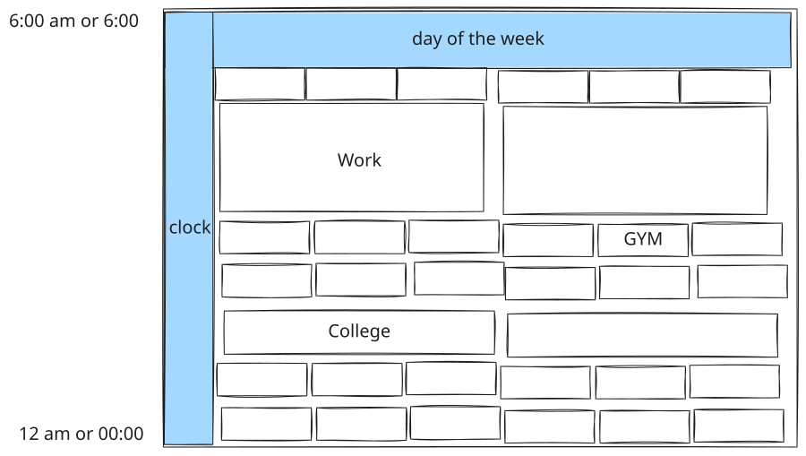
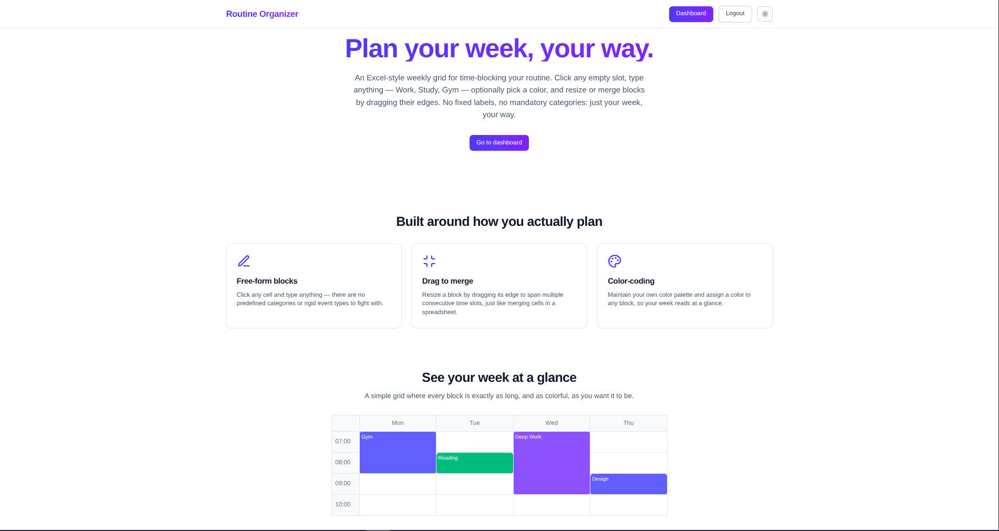
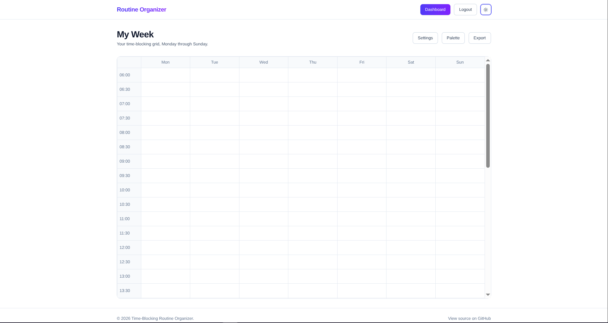
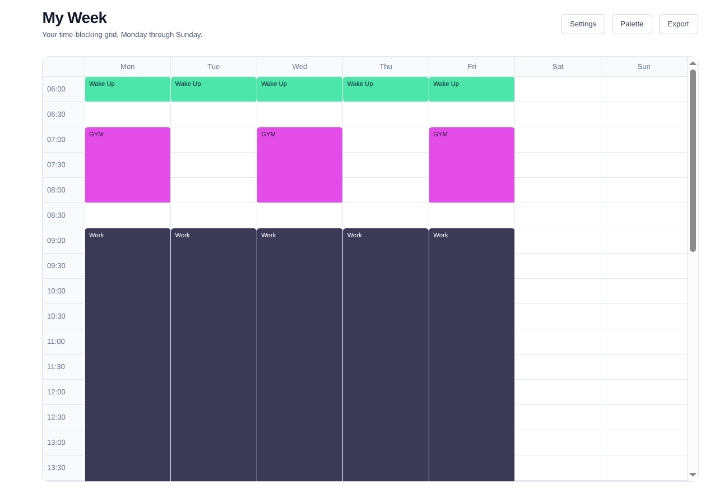
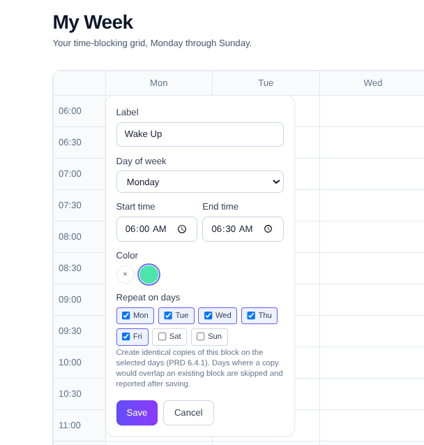
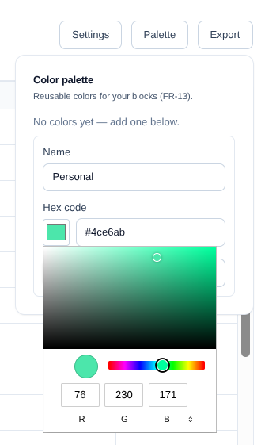
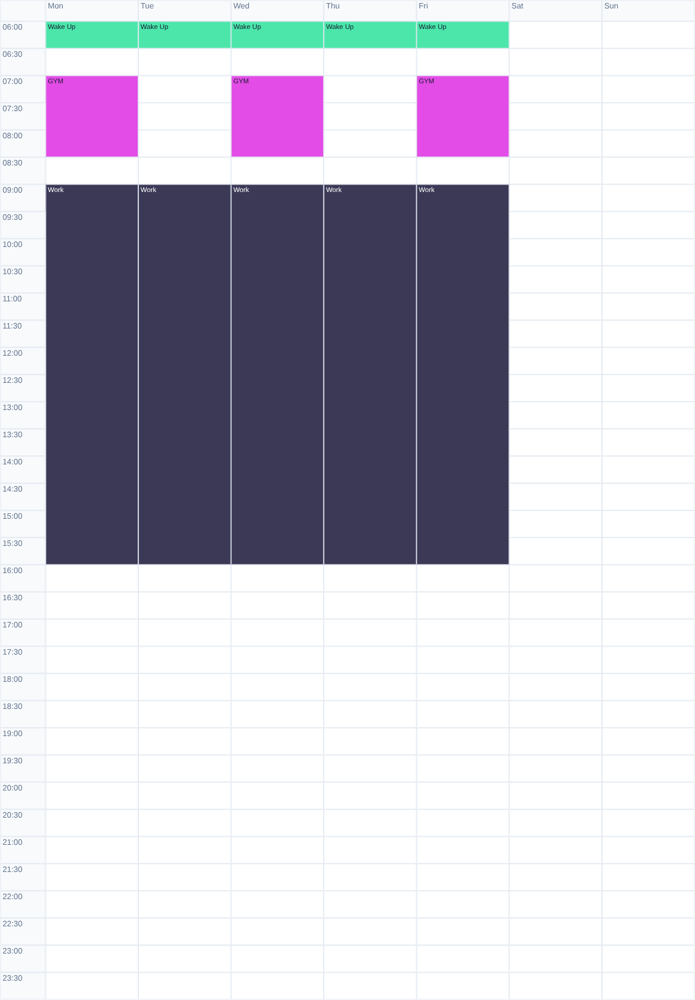

# Django Weekly Planner

<details>
<summary>Where it started</summary>
<br>



The napkin sketch this was built from, before any code existed — day columns, time-slot rows, free-form colored blocks. Kind of nice to see it turn into everything below.
</details>

***

*A time-blocking weekly planner, built like a spreadsheet.*
<picture>
  <source media="(prefers-color-scheme: dark)" srcset="assets/ForTheReadme/MainPageDark.png">
  <source media="(prefers-color-scheme: light)" srcset="assets/ForTheReadme/MainPageLight.png">
  
</picture>

Click an empty slot, type whatever you want — "Gym", "Deep work", "Pick up the kids" — optionally pick a color, and drag an edge to make it longer. That's the whole interaction model. No fixed categories, no mandatory event fields, no calendar-app ceremony.

This started as a personal itch — wanting to block out a week without fighting a calendar app that insists on "events" with invites and reminders — and turned into a small, honest Django template anyone can clone and run for themselves.

## A quick look

<table>
<tr>
<td width="50%"></td>
<td width="50%"></td>
</tr>
<tr>
<td align="center"><sub>Your week, empty</sub></td>
<td align="center"><sub>...and with a routine blocked in</sub></td>
</tr>
<tr>
<td width="50%"></td>
<td width="50%"></td>
</tr>
<tr>
<td align="center"><sub>Click a cell, type a label</sub></td>
<td align="center"><sub>Bring your own colors</sub></td>
</tr>
</table>

## Features

- **Free-form time blocks.** Click any empty grid cell and type anything — no fixed labels, no mandatory categories.
- **Vertical resize (merge).** Drag a block's edge, or use the +/- keyboard fallback, to span multiple consecutive time slots.
- **Repeat across days.** Create a block once and copy it to other days in the same request; days where it would overlap are skipped and reported, not silently dropped.
- **Personal color palette.** Name + hex colors you manage yourself; deleting a color leaves affected blocks with a neutral fallback appearance instead of breaking anything.
- **Export anywhere.** Grab your week as Markdown, SVG, or PNG, or hit print for a clean PDF — all generated from your real data, zero extra dependencies.
- **Zero full-page reloads.** Every block/color/settings operation is an HTMX partial swap.
- **Light/dark theme**, persisted per browser, honored on every screen.
- **Configurable grid**: 30 or 60-minute slots, any day-start/day-end range (including a range that crosses midnight), 24h or 12h AM/PM display.
- **Native Django auth** — no extra auth package.

## Export your week



Markdown lists every block you own, exactly as entered; SVG and PNG mirror what's on screen for your current day range. Take a look at a real sample export: [Markdown](assets/ForTheReadme/weekly-planner.md) · [SVG](assets/ForTheReadme/weekly-planner.svg).

## Tech stack

| Layer | Choice |
|---|---|
| Language / framework | Python 3.12+, Django 6.0 |
| Templates | Django Template Language, server-rendered |
| Styling | TailwindCSS v4 (standalone CLI, no Node.js) |
| Interactivity | HTMX + a small amount of Vanilla JS (drag-to-resize, theme toggle, color-hex sync, text-contrast, export) |
| Database | SQLite (single file) |
| Auth | `django.contrib.auth` (native) |
| Dependency management | [`uv`](https://docs.astral.sh/uv/) |

See `docs/ProductRequirementDocument.md` for the full spec and `docs/ARCHITECTURE.md` for how the codebase actually turned out sprint by sprint, including every deliberate deviation from the spec.

## Project structure

```
django-weekly-planner/
├── manage.py
├── pyproject.toml       # uv-managed; django is the only runtime dependency
├── Dockerfile
├── docker-compose.yml
├── config/              # settings.py, urls.py, wsgi.py, asgi.py
├── apps/
│   ├── core/             # landing page, dashboard shell, TimestampedModel
│   ├── accounts/         # native signup/login/logout
│   └── planner/          # BlockColor/PlannerSettings/TimeBlock models, grid builder, export, HTMX views
├── templates/            # base.html + shared partials (navbar, footer, buttons, form fields)
├── static/               # css/ (Tailwind source + compiled output), js/
└── db.sqlite3            # gitignored; created by `migrate`
```

Full breakdown of every file's purpose lives in `docs/ARCHITECTURE.md`'s "Directory layout" section.

## Development

### Requirements

- Python 3.12+
- [`uv`](https://docs.astral.sh/uv/) for dependency management
- No Node.js / npm required — CSS is built with the Tailwind **standalone CLI** binary (PRD risk R4).
- Optionally, Docker + the Compose plugin, if you'd rather not install Python/uv locally at all (see "Run with Docker" below).

### Backend

```sh
uv sync
uv run python manage.py migrate
uv run python manage.py runserver
```

### TailwindCSS build pipeline

This project uses **Tailwind CSS v4** with its CSS-first configuration — there is no `tailwind.config.js`. Dark mode and template source paths are declared directly in `static/css/input.css`:

```css
@import 'tailwindcss';
@custom-variant dark (&:where(.dark, .dark *));
@source '../../templates';
@source '../../apps';
```

> **Deviation from PRD §13 task 1.3:** the PRD describes a v3-style workflow (`@tailwind` directives, `tailwind.config.js`, `darkMode: 'class'`). Tailwind is now v4 and configures itself in CSS instead of JavaScript, so those concepts map onto `@import`, `@custom-variant dark`, and `@source` as shown above. There is intentionally no `tailwind.config.js` in this repository.

The CLI itself is a self-contained executable (no npm project, nothing in `package.json`) and is **not committed** to the repository (~100 MB binary) — download it once per machine into `bin/`, which is git-ignored:

```sh
# Linux x86_64 (this project's dev environment)
mkdir -p bin
curl -sL -o bin/tailwindcss https://github.com/tailwindlabs/tailwindcss/releases/latest/download/tailwindcss-linux-x64
chmod +x bin/tailwindcss
```

For other platforms, swap the asset name (`tailwindcss-macos-arm64`, `tailwindcss-macos-x64`, `tailwindcss-windows-x64.exe`, ...) — see the [release page](https://github.com/tailwindlabs/tailwindcss/releases/latest).

Build the compiled stylesheet (`static/css/app.css`, which **is** committed — PRD risk R4):

```sh
./bin/tailwindcss -i static/css/input.css -o static/css/app.css
```

Watch for changes while developing templates:

```sh
./bin/tailwindcss -i static/css/input.css -o static/css/app.css --watch
```

Minify for a production build:

```sh
./bin/tailwindcss -i static/css/input.css -o static/css/app.css --minify
```

**Whenever you add or change a Tailwind utility class in any template, rebuild `app.css` before judging the page — an unbuilt stylesheet is not a design bug.**

### Running tests

```sh
uv run python manage.py test
```

Runs the full suite (models, views, and the pure-Python grid/export builders) against Django's own throwaway test database — nothing here depends on `db.sqlite3` or any seeded data, so this passes clean from a fresh clone right after `uv sync` + `migrate`. Verified to pass identically under `--shuffle`, `--reverse`, and `--parallel 4` — no test-ordering or shared-state dependency.

### Run with Docker

No local Python/`uv` install needed — only Docker and the Compose plugin.

```sh
cp .env.example .env   # optional; the app boots with dev-safe defaults even without it
docker compose build
docker compose up -d
```

> **Dev-only defaults.** Without a `.env` file, the container runs with `DEBUG=True` and an empty
> `ALLOWED_HOSTS` — fine for a quick local look, but that means verbose debug tracebacks are
> served to anyone who can reach it. Before exposing this container beyond `localhost`, set
> `DEBUG=False` and a real, non-empty `ALLOWED_HOSTS` in `.env`.

This builds a `python:3.12-slim` image (dependencies installed via `uv`, static files collected at build time, served by WhiteNoise — no separate nginx needed), then on container start runs `manage.py migrate` before starting `gunicorn`. The app is reachable at **http://localhost:2000** (port 8000 is left free for a local `runserver`; change the host-side port in `docker-compose.yml` if you'd like it on 8000 instead).

The SQLite database lives in a named Docker volume (`sqlite_data`, mounted at `/app/data` in the container) so your data survives `docker compose down`/`up` — use `docker compose down -v` if you actually want to wipe it.

```sh
docker compose logs -f web      # follow startup/request logs
docker compose exec web python manage.py createsuperuser
docker compose exec web python manage.py test   # run the test suite inside the container
docker compose down             # stop (keeps the sqlite_data volume)
```

For a production-like run (hashed, far-future-cacheable static file URLs), set `DEBUG=False` and a non-empty `ALLOWED_HOSTS` in `.env`, then `docker compose up -d` — no rebuild needed, since these are read from the environment at container start, not baked into the image. Also replace the fallback `SECRET_KEY` (see `.env.example`'s own guidance) — it ships in this public repository and must never be used as-is outside local development.

## Design system

Full token table and component patterns are documented in `docs/ProductRequirementDocument.md` §9 and mirrored in `static/css/input.css`'s header comment. Summary:

| Token | Light | Dark | Usage |
|---|---|---|---|
| Primary | `indigo-600` | `indigo-400` | Buttons, links, active states |
| Primary gradient | `from-indigo-600 to-violet-600` | `from-indigo-500 to-violet-500` | Hero, primary CTAs, navbar brand |
| Surface | `white` / `slate-50` | `slate-900` / `slate-800` | Page and card backgrounds |
| Grid lines | `slate-200` | `slate-700` | Table/grid borders |
| Text | `slate-900` / `slate-600` | `slate-100` / `slate-400` | Headings / secondary text |
| Success | `emerald-500` | `emerald-400` | Confirmation states |
| Danger | `rose-600` | `rose-500` | Delete actions, validation errors |

Every screen extends one `templates/base.html`; shared buttons/form-field/grid partials keep class strings from drifting between screens (see `docs/ARCHITECTURE.md`'s "Design system" section for the extraction history and a couple of deliberate, documented exceptions).

## Contributing

See [`CONTRIBUTING.md`](CONTRIBUTING.md) for how to add a new app, swap the color palette/design tokens, change the default grid settings, and switch off SQLite.

## License

[PolyForm Noncommercial License 1.0.0](LICENSE) — free for personal, noncommercial use (studying it, running it for yourself, adapting it for a hobby project). Selling this software, or using it for any commercial purpose, is not permitted.

