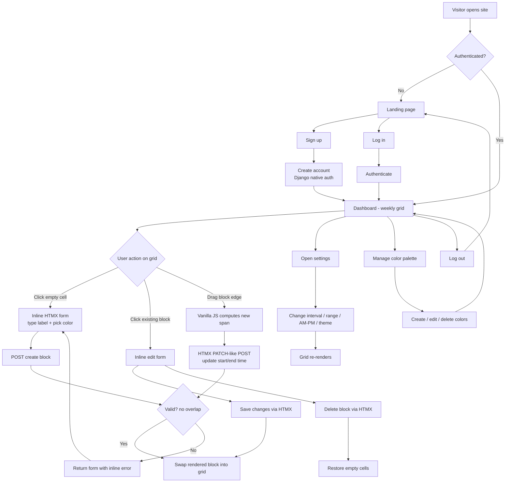
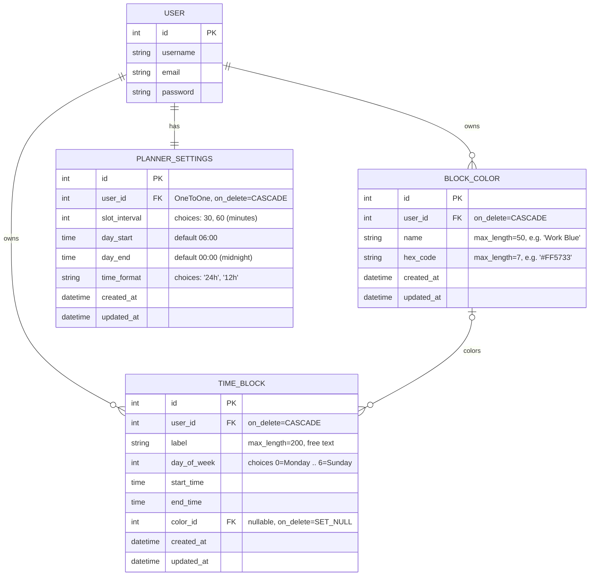

# PRD — Time-Blocking Routine Organizer

**Version:** 1.0
**Status:** Draft for development
**Stack:** Django (full stack) · Django Template Language · TailwindCSS · HTMX · Vanilla JS · SQLite

---

## 1. Overview

The Time-Blocking Routine Organizer is a full-stack Django web application for scheduling and routine organization based on the *time-blocking* method. The interface is an Excel-style weekly grid: columns represent the days of the week (X-axis) and rows represent time slots (Y-axis, e.g., 06:00–00:00, with a 12h AM/PM display option), with a user-configurable interval (30 or 60 minutes).

Its main differentiator is a modular, free-form, interactive grid: the user clicks any empty cell and types anything ("Work", "Study", "Gym"), optionally assigns a color, and can freely create, resize, and merge blocks vertically and horizontally (`rowspan`/`grid-row` behavior) — with no fixed labels and no mandatory categories.

The project is intentionally **simple and lean**: Django Template Language on the frontend, TailwindCSS for styling, HTMX + a small amount of Vanilla JavaScript for interactivity (no SPA framework), Django's native authentication, and SQLite as the only database. The long-term goal is a generic, documented, containerized open-source template any developer can clone, run, and adapt — but Docker and automated tests are deliberately deferred to the final sprints.

---

## 2. About the Product

The product is a personal weekly planner rendered as an interactive spreadsheet-like grid:

- **Grid layout:** days of the week as columns; time slots as rows; slot interval configurable per user (30/60 min); day range configurable (e.g., 06:00 to 00:00); time display in 24h or 12h AM/PM.
- **Free-form blocks:** click an empty cell → type a label → block created. No predefined categories.
- **Merging/resizing:** blocks can span multiple consecutive time slots (vertical merge, like `rowspan`) and be replicated/extended across days (horizontal spanning handled as per-day blocks that visually align).
- **Color-coding:** the user maintains a personal color palette (name + hex) and can optionally assign a color to each block.
- **No full page reloads:** all block operations (create, edit, resize, recolor, delete) happen via HTMX partial swaps; click-and-drag resize uses Vanilla JS that triggers HTMX requests.
- **Structure:** a public landing/presentation site with sign-up and login; after login, the user lands on the dashboard where the time-blocking grid lives.
- **Django apps:** `core` (landing, dashboard shell, shared abstract models), `accounts` (native auth flows), `planner` (scheduling domain).

Everything in the codebase — code, comments, identifiers, templates, documentation — is written in **English**, follows **PEP 8**, uses **single quotes**, prefers **Class-Based Views** and Django-native features, and every model includes `created_at` and `updated_at` fields.

---

## 3. Purpose

- Give individuals a frictionless, visual way to plan their week using time-blocking, without the rigidity of typical calendar tools (no event categories, no mandatory metadata, no external sync complexity).
- Demonstrate a clean, modern, non-over-engineered Django full-stack architecture (DTL + Tailwind + HTMX) that can later serve as a public open-source starter template.
- Keep cognitive and technical overhead minimal: one database file, one styling system, one interaction library, native auth.

---

## 4. Target Audience

- **Primary:** individuals who plan their week visually — students, freelancers, remote workers, productivity enthusiasts who already use spreadsheets or paper for time-blocking.
- **Secondary:** Django developers looking for a realistic, well-structured, lean full-stack reference project (future open-source template audience).

Assumptions: desktop-first usage (grid-heavy UI), but the layout must remain usable on tablets and readable on mobile.

---

## 5. Objectives

1. Ship a working MVP where a user can sign up, log in, and fully manage a weekly time-blocking grid (create, edit, resize, color, delete blocks) without page reloads.
2. Keep the entire stack Django-native: DTL templates, CBVs, native auth, SQLite, signals only where justified (in `signals.py`).
3. Deliver a consistent design system (Tailwind utility patterns shared across all screens) with light/dark support, gradients, and a harmonious palette.
4. Maintain simplicity: no ORMs beyond Django's, no SPA, no REST framework, no Celery, no Docker/tests until the final sprints.
5. Leave the project ready to become a documented, containerized open-source template in the final sprints.

---

## 6. Functional Requirements

**FR-01 — Public landing page.** A presentation page describing the product, with prominent Sign Up and Log In actions. Accessible without authentication.

**FR-02 — Sign up.** Registration using Django's native `UserCreationForm` (adapted for styling). On success, the user is authenticated and redirected to the dashboard.

**FR-03 — Log in / Log out.** Django's native auth views (`LoginView`, `LogoutView`) with styled templates. Authenticated users visiting the landing page see a "Go to dashboard" action.

**FR-04 — Auth-protected dashboard.** After login, the user is redirected to the dashboard containing the weekly grid. All planner routes require authentication (`LoginRequiredMixin`).

**FR-05 — Weekly grid rendering.** The dashboard renders a grid: 7 day columns (Monday–Sunday) × time-slot rows derived from the user's settings (start hour, end hour, interval). Blocks render inside the grid occupying `rowspan` proportional to their duration.

**FR-06 — Grid settings.** Per-user planner settings: slot interval (30 or 60 min), day start time, day end time (supporting a range like 06:00–00:00), and time display format (24h or 12h AM/PM). Changing settings re-renders the grid.

**FR-07 — Create block.** Clicking an empty cell opens an inline HTMX form in place; the user types a free-text label (required) and optionally picks a color; submitting creates the block and swaps in the rendered block cell without a page reload.

**FR-08 — Edit block.** Clicking an existing block opens an inline edit form (label, color, start/end time, day). Saving swaps the updated block into the grid.

**FR-09 — Resize block (vertical merge).** The user drags the bottom edge of a block to extend/shrink it across consecutive slots. On release, Vanilla JS triggers an HTMX request updating `end_time` (or `start_time` when dragging the top edge); the server validates and returns the re-rendered column/grid fragment.

**FR-10 — Horizontal spanning.** From a block's edit form (or drag across columns), the user can extend the block to adjacent days; the server materializes it per day so each day column stays independent, while the UI keeps visual alignment.

**FR-11 — Delete block.** A delete action on the block (edit form or hover control) removes it via HTMX and restores the empty cells.

**FR-12 — Overlap validation.** The server rejects blocks that overlap an existing block on the same day for the same user, returning the form with an inline error message (rendered by HTMX).

**FR-13 — Color palette management.** The user can create, rename, recolor, and delete colors (name + hex). Colors are selectable in block forms; deleting a color sets affected blocks' color to null (`on_delete=SET_NULL`).

**FR-14 — Theme toggle.** Light/dark theme toggle available on all screens, persisted (Tailwind `dark:` variant + small JS + `localStorage`).

**FR-15 — Django admin.** `TimeBlock`, `BlockColor`, and planner settings registered in the admin for maintenance.

### 6.1 UX Flow (Mermaid)



---

## 7. Non-Functional Requirements

- **NFR-01 — Simplicity.** No over-engineering: no SPA frameworks, no DRF, no CQRS, no third-party ORMs, no task queues. Only the libraries explicitly listed in the stack.
- **NFR-02 — Code standards.** PEP 8, single quotes, English-only code and content, CBVs whenever possible, signals only inside `signals.py` per app.
- **NFR-03 — Performance.** Grid render under ~200 ms server-side for a typical week (≤ 100 blocks); HTMX fragment responses small and scoped (cell/column-level swaps, not full-grid unless needed).
- **NFR-04 — Responsiveness.** Layout adapts from desktop (full 7-column grid) down to tablet (horizontal scroll on grid) and mobile (readable, scrollable grid).
- **NFR-05 — Consistency.** Single design system: every screen uses the same base template, navbar, footer, buttons, inputs, and color tokens.
- **NFR-06 — Accessibility basics.** Semantic HTML, focus states, sufficient color contrast in both themes, keyboard-accessible forms.
- **NFR-07 — Security.** Django defaults: CSRF on all HTMX POSTs (`hx-headers` or hidden input), session auth, per-user data isolation (all queries filtered by `request.user`).
- **NFR-08 — Data integrity.** Every model has `created_at`/`updated_at`; server-side validation is authoritative (client JS is convenience only).
- **NFR-09 — Portability (deferred).** Final sprints add Docker and documentation so the project runs identically anywhere as an open-source template.
- **NFR-10 — Testing (deferred).** Final sprints add automated tests for models, views, and validation rules.

---

## 8. Technical Architecture

### 8.1 Stack

| Layer | Choice | Notes |
|---|---|---|
| Language | Python 3.12+ | PEP 8, single quotes |
| Framework | Django 5.x | Full stack, CBVs, native auth |
| Templates | Django Template Language | Server-rendered; partials for HTMX swaps |
| Styling | TailwindCSS | Via `django-tailwind` or standalone CLI build into `static/css/` |
| Interactivity | HTMX + Vanilla JS | HTMX for CRUD swaps; JS only for click-and-drag resize and theme toggle |
| Database | SQLite (Django default) | Single file `db.sqlite3` |
| Auth | `django.contrib.auth` | Native user model, `LoginView`, `LogoutView`, `UserCreationForm` |
| Admin | Django admin | Planner models registered |
| Config | `config/` project package + `apps/` namespace | `.env.example` for secrets pattern (e.g., `SECRET_KEY`, `DEBUG`) |
| Deferred | Docker, automated tests | Final sprints only |

**Directory architecture** (as specified):

```
routine_organizer/
├── manage.py
├── requirements.txt
├── .env.example
├── .gitignore
├── config/            # settings.py, urls.py, wsgi.py, asgi.py
├── apps/
│   ├── core/          # landing, dashboard shell, TimestampedModel
│   ├── accounts/      # signup/login/logout views, forms, templates
│   └── planner/       # models, views, urls, forms, signals, admin, grid templates
├── templates/         # base.html, partials/navbar.html, partials/footer.html
├── static/            # css/, js/, img/
└── db.sqlite3
```

### 8.2 Data Structure (Mermaid Schemas)

All models inherit from an abstract `TimestampedModel` in `apps/core/models.py` providing `created_at` (`auto_now_add`) and `updated_at` (`auto_now`).



**Model behavior notes:**

- `TimeBlock.get_duration_minutes()` returns the block duration in minutes (handling midnight-crossing end at 00:00), used by templates to compute `rowspan = duration / settings.slot_interval`.
- `TimeBlock.clean()` enforces `start_time < end_time` (with the 00:00-as-midnight exception) and no overlap with the user's other blocks on the same `day_of_week`.
- `PLANNER_SETTINGS` is created automatically for each new user via a `post_save` signal on `User`, living in `apps/planner/signals.py` and registered in `PlannerConfig.ready()`.
- Uniqueness: `BLOCK_COLOR` has `unique_together (user, name)`.

---

## 9. Design System

A single visual identity implemented with Tailwind utility classes inside DTL. Reusable patterns live in `templates/base.html`, `templates/partials/`, and app-level partials — repeated class strings are centralized via `` partials and, where helpful, small template tags.

### 9.1 Color Tokens

| Token | Light | Dark | Usage |
|---|---|---|---|
| Primary | `indigo-600` | `indigo-400` | Buttons, links, active states |
| Primary gradient | `from-indigo-600 to-violet-600` | `from-indigo-500 to-violet-500` | Hero, primary CTAs, navbar accent |
| Surface | `white` / `slate-50` | `slate-900` / `slate-800` | Page and card backgrounds |
| Grid lines | `slate-200` | `slate-700` | Table/grid borders |
| Text | `slate-900` / `slate-600` | `slate-100` / `slate-400` | Headings / secondary text |
| Success | `emerald-500` | `emerald-400` | Confirmation states |
| Danger | `rose-600` | `rose-500` | Delete actions, validation errors |

Dark mode uses Tailwind's `class` strategy (`dark:` variants), toggled by a small JS snippet persisting to `localStorage`.

### 9.2 Component Patterns (Tailwind in DTL)

- **Buttons:**
  - Primary: `inline-flex items-center gap-2 rounded-lg bg-gradient-to-r from-indigo-600 to-violet-600 px-4 py-2 text-sm font-medium text-white shadow-sm hover:opacity-90 focus:outline-none focus:ring-2 focus:ring-indigo-500`
  - Secondary: `rounded-lg border border-slate-300 dark:border-slate-600 px-4 py-2 text-sm font-medium text-slate-700 dark:text-slate-200 hover:bg-slate-100 dark:hover:bg-slate-700`
  - Danger: same shape with `bg-rose-600 text-white hover:bg-rose-700`
- **Inputs:** `w-full rounded-lg border border-slate-300 dark:border-slate-600 bg-white dark:bg-slate-800 px-3 py-2 text-sm text-slate-900 dark:text-slate-100 focus:border-indigo-500 focus:ring-indigo-500` — applied to Django form widgets via form `__init__` widget attrs.
- **Forms:** vertical stack `space-y-4`, labels `block text-sm font-medium text-slate-700 dark:text-slate-300`, errors `text-sm text-rose-600 dark:text-rose-400`.
- **Cards:** `rounded-xl bg-white dark:bg-slate-800 shadow-sm ring-1 ring-slate-200 dark:ring-slate-700 p-6`.
- **Navbar:** sticky top bar, `backdrop-blur bg-white/80 dark:bg-slate-900/80 border-b border-slate-200 dark:border-slate-800`, brand with gradient text `bg-gradient-to-r from-indigo-600 to-violet-600 bg-clip-text text-transparent`.
- **Footer:** minimal, `border-t border-slate-200 dark:border-slate-800 text-sm text-slate-500`.
- **Grid:** HTML `<table>` (natural `rowspan` support) with `table-fixed w-full border-collapse`; sticky header row (day names) and sticky first column (time labels) using `sticky top-0 / left-0`; empty cells `h-12 border border-slate-200 dark:border-slate-700 hover:bg-indigo-50 dark:hover:bg-slate-700/50 cursor-pointer`; block cells filled with the block's hex color (inline `style`) plus `rounded-md text-xs font-medium p-1` and a JS-computed readable text color.
- **Menus/dropdowns:** simple `<details>`/absolute-positioned panels styled as cards — no JS menu library.
- **Fonts:** `Inter` (via `@fontsource` file in `static/` or system fallback stack `font-sans`), headings `font-semibold tracking-tight`.

### 9.3 Layout Rules

- All pages extend `base.html` (navbar + content container `mx-auto max-w-7xl px-4` + footer).
- Auth pages (login/signup) use a centered card layout (`min-h-screen grid place-items-center`).
- Dashboard uses full-width grid area with a compact toolbar (settings, palette, theme toggle).

---

## 10. User Stories

### Epic E1 — Public Site & Authentication

- **US-1.1** As a visitor, I want to see a landing page explaining the product, so I understand its value before signing up.
  - *Acceptance:* Landing renders at `/` without auth; contains hero, feature highlights, Sign Up and Log In CTAs; fully styled with the design system in light and dark themes.
- **US-1.2** As a visitor, I want to create an account, so I can have my own planner.
  - *Acceptance:* `/accounts/signup/` renders a styled `UserCreationForm`; invalid input shows inline errors; success logs me in and redirects to the dashboard.
- **US-1.3** As a registered user, I want to log in and log out.
  - *Acceptance:* Native `LoginView`/`LogoutView` wired with styled templates; wrong credentials show an error; logout returns to the landing page; `LOGIN_REDIRECT_URL` points to the dashboard.

### Epic E2 — Grid Foundation & Settings

- **US-2.1** As a user, I want to see my week as a grid of days × time slots.
  - *Acceptance:* Dashboard shows Monday–Sunday columns and rows from `day_start` to `day_end` at `slot_interval`; time labels respect the 24h/12h setting; grid renders my blocks with correct `rowspan`.
- **US-2.2** As a user, I want to configure interval, day range, and time format.
  - *Acceptance:* Settings form (30/60 min, start/end time, 24h/AM-PM) saves via HTMX or standard POST and the grid re-renders accordingly; settings are auto-created on signup via signal.

### Epic E3 — Block Management

- **US-3.1** As a user, I want to click an empty cell and type anything to create a block.
  - *Acceptance:* Click swaps in an inline form pre-filled with that cell's day/start/end; submitting a non-empty label creates the block and renders it in place; empty label shows an inline error; no page reload.
- **US-3.2** As a user, I want to edit a block's label, color, day, and times.
  - *Acceptance:* Clicking a block opens the inline edit form; saving updates the grid fragment; validation errors render inline.
- **US-3.3** As a user, I want to resize a block by dragging its edge to merge slots vertically.
  - *Acceptance:* Dragging the bottom (or top) edge previews the new span; releasing persists via HTMX; server clamps to grid bounds and rejects overlaps, restoring the previous state with an error message.
- **US-3.4** As a user, I want to extend a block across adjacent days.
  - *Acceptance:* From the edit form (day multi-extend) or horizontal drag, per-day copies are created with the same label/color/times; each can afterwards be edited independently.
- **US-3.5** As a user, I want to delete a block.
  - *Acceptance:* Delete control removes the block via HTMX and the freed cells become clickable empty cells again.
- **US-3.6** As a user, I never want two of my blocks to overlap on the same day.
  - *Acceptance:* Any create/edit/resize producing an overlap is rejected server-side with a clear inline message; the grid remains consistent.

### Epic E4 — Color Palette & Theming

- **US-4.1** As a user, I want a personal color palette (name + hex) for color-coding blocks.
  - *Acceptance:* Palette panel lists my colors; I can add (name + hex picker), edit, and delete; colors appear as swatches in block forms; deleting a color leaves affected blocks colorless.
- **US-4.2** As a user, I want to switch between light and dark themes.
  - *Acceptance:* Toggle in navbar; preference persists across sessions (`localStorage`); every screen honors both themes.

### Epic E5 — Template Readiness (Final Sprints)

- **US-5.1** As a developer, I want automated tests so I can adapt the template safely.
  - *Acceptance:* Test suite covers models (duration, validation, overlap), views (auth protection, CRUD), and signals; `python manage.py test` passes.
- **US-5.2** As a developer, I want to run the project with Docker and clear docs.
  - *Acceptance:* `Dockerfile` + `docker-compose.yml` run the app with one command; README documents setup (local and Docker), architecture, and customization points.

---

## 11. Success Metrics

**Product KPIs**

- Time-to-first-block: a new user creates their first block in under 2 minutes after signup.
- Weekly grid interaction success rate: > 99% of HTMX block operations complete without error (server logs).
- Zero full-page reloads required for any block operation.

**User KPIs**

- Activation: ≥ 60% of new signups create at least 3 blocks in their first session.
- Retention proxy: ≥ 40% of users return within 7 days and modify their grid.
- Average blocks per active user per week: ≥ 10.

**Engineering / Template KPIs**

- Grid page server render time < 200 ms with 100 blocks (local benchmark).
- Codebase remains dependency-lean: ≤ 5 entries in `requirements.txt` before final sprints.
- Final sprints: test coverage of models and planner views ≥ 80%; fresh clone → running app via Docker in ≤ 2 commands.

---

## 12. Risks and Mitigation

| # | Risk | Impact | Mitigation |
|---|---|---|---|
| R1 | Click-and-drag resize complexity creeps toward SPA-like JS | Scope/complexity blowout | Constrain JS to one small module (`static/js/grid-drag.js`); all state changes go through HTMX/server; ship click-based resize first, drag as enhancement |
| R2 | `rowspan` table rendering with merged blocks becomes hard to compute in templates | Buggy grid | Compute the grid matrix server-side in the view (Python builds rows/cells/spans); templates only iterate — no logic-heavy DTL |
| R3 | Overlap validation edge cases (midnight end, interval changes) | Data inconsistency | Centralize validation in `TimeBlock.clean()`; treat `00:00` end as 24:00; clamp/flag blocks that fall outside a newly narrowed day range instead of deleting them |
| R4 | Tailwind build workflow friction in a no-Node preference project | DX pain | Use Tailwind standalone CLI binary (no Node project needed) with a documented `build-css` command; commit compiled CSS |
| R5 | Design drift between screens | Inconsistent UI | All screens extend `base.html`; shared partials for buttons/forms; design tokens documented in this PRD and mirrored in a `static/css/` comment header |
| R6 | Deferred tests allow regressions to accumulate | Rework at the end | Keep views thin and models fat (logic in models/managers), making late test-writing cheap; manual smoke checklist per sprint |
| R7 | SQLite concurrency limits if the template is deployed multi-user at scale | Performance ceiling | Acceptable for scope; document the limitation and the settings switch point in the final README |
| R8 | Horizontal merge semantics confuse users (one block vs. per-day copies) | UX confusion | UI language: "repeat on other days"; edits after spanning act per-day; document behavior in a small tooltip |

---

## 13. Task List (Sprints)

> Format: `- [ ]` unchecked / `- [x]` done. Tasks are intentionally granular.

### Sprint 1 — Project Foundation & Design System Base

- [x] **1.1 Repository and environment setup**
    - [x] 1.1.1 Create project root `routine_organizer/`, initialize git, add `.gitignore` (Python, SQLite, `.env`, compiled CSS artifacts as appropriate).
    - [x] 1.1.2 Create virtualenv; install Django 5.x; freeze `requirements.txt`. *(Deviation: Django 6.0.7 via `uv`/`pyproject.toml`, not `requirements.txt` — see `docs/ARCHITECTURE.md`.)*
    - [x] 1.1.3 Add `.env.example` with `SECRET_KEY`, `DEBUG`, `ALLOWED_HOSTS`; load values in `settings.py` via `os.environ` with sane defaults (no extra dotenv dependency unless needed).
- [x] **1.2 Django project scaffold**
    - [x] 1.2.1 `django-admin startproject config .` producing `config/settings.py`, `urls.py`, `wsgi.py`, `asgi.py`. *(Achieved via renaming the pre-existing `core/` settings package to `config/` — see deviation note in `docs/ARCHITECTURE.md`.)*
    - [x] 1.2.2 Create `apps/` package; create apps `core`, `accounts`, `planner` under it; set each `AppConfig.name` to `apps.<name>`.
    - [x] 1.2.3 Register the three apps in `INSTALLED_APPS`; configure `TEMPLATES['DIRS']` to include root `templates/`; configure `STATICFILES_DIRS` with root `static/`.
    - [x] 1.2.4 Set `LANGUAGE_CODE = 'en-us'`, project timezone, and confirm SQLite default database config.
    - [x] 1.2.5 Run initial migrations; verify dev server boots.
- [x] **1.3 TailwindCSS pipeline**
    - [x] 1.3.1 Add Tailwind standalone CLI workflow: `static/css/input.css` with `@tailwind` directives → compiled `static/css/app.css`; document the build/watch command in README stub. *(Deviation: Tailwind v4 CSS-first `@import`, not `@tailwind` directives — see `docs/ARCHITECTURE.md`.)*
    - [x] 1.3.2 Configure `tailwind.config.js` content globs for `templates/**/*.html` and `apps/**/templates/**/*.html`; enable `darkMode: 'class'`. *(Deviation: Tailwind v4 has no `tailwind.config.js`; uses `@source` directives and `@custom-variant dark` in `input.css` instead.)*
    - [x] 1.3.3 Verify a Tailwind class renders on a test page in both light and dark. *(Verified via compiled CSS output; live browser confirmation deferred to `qa-tester` once Playwright MCP is configured.)*
- [x] **1.4 Base templates and shared partials**
    - [x] 1.4.1 Create `templates/base.html`: HTML skeleton, `` CSS include, HTMX `<script>` include (vendored file in `static/js/htmx.min.js`), blocks for `title` and `content`, dark-mode class hook on `<html>`.
    - [x] 1.4.2 Create `templates/partials/navbar.html`: brand (gradient text), auth-aware links (Login/Signup vs. Dashboard/Logout), theme toggle button placeholder.
    - [x] 1.4.3 Create `templates/partials/footer.html`: minimal footer with project name and repo link placeholder.
    - [x] 1.4.4 Implement theme toggle: `static/js/theme.js` reading/writing `localStorage` and toggling the `dark` class; include in `base.html`.
    - [x] 1.4.5 Add CSRF support for HTMX: hidden meta/`hx-headers` pattern in `base.html` so every HTMX POST carries the token.
- [x] **1.5 Core app shell**
    - [x] 1.5.1 Create `apps/core/models.py` with abstract `TimestampedModel` (`created_at`, `updated_at`).
    - [x] 1.5.2 Create `apps/core/views.py` with `LandingView(TemplateView)` and `DashboardView(LoginRequiredMixin, TemplateView)` (placeholder content for now).
    - [x] 1.5.3 Create `apps/core/urls.py` (`''` → landing, `'dashboard/'` → dashboard); include in `config/urls.py` along with admin.
    - [x] 1.5.4 Create placeholder `core/landing.html` and `core/dashboard.html` extending `base.html`; verify navigation works. *(URL reversal verified; full-page render of `accounts:*` links is blocked by `NoReverseMatch` until Sprint 2 adds `apps/accounts` URLs — expected, sequenced gap, see `docs/ARCHITECTURE.md`.)*

### Sprint 2 — Accounts (Native Authentication)

- [x] **2.1 Auth configuration**
    - [x] 2.1.1 Set `LOGIN_URL`, `LOGIN_REDIRECT_URL = 'dashboard'`, `LOGOUT_REDIRECT_URL = 'landing'` in settings. *(Deviation: namespaced values `accounts:login` / `core:dashboard` / `core:landing`, matching this project's `apps.<name>` URL-namespacing convention — see `docs/ARCHITECTURE.md`.)*
    - [x] 2.1.2 Create `apps/accounts/urls.py` wiring `LoginView` (custom template) and `LogoutView`; include under `'accounts/'`.
- [x] **2.2 Signup flow**
    - [x] 2.2.1 Create `apps/accounts/forms.py` with `SignUpForm(UserCreationForm)` applying Tailwind widget classes in `__init__`.
    - [x] 2.2.2 Create `SignUpView(CreateView)` in `apps/accounts/views.py`: uses `SignUpForm`, logs the user in on success (`form_valid`), redirects to dashboard.
    - [x] 2.2.3 Route `'accounts/signup/'` to `SignUpView`.
- [x] **2.3 Auth templates (design system)**
    - [x] 2.3.1 Build `accounts/login.html`: centered card, styled inputs, error rendering, links to signup. *(Also added `LoginForm(AuthenticationForm)` so the default login form's inputs get the same Tailwind classes `SignUpForm` gets — not in the PRD's literal task list but required for 2.3.1's "styled inputs" to actually hold, since `LoginView` uses `AuthenticationForm` by default.)*
    - [x] 2.3.2 Build `accounts/signup.html`: same card pattern, field help texts styled subtly, link to login.
    - [x] 2.3.3 Update navbar to reflect auth state correctly on all pages. *(Verified — `navbar.html` from Sprint 1 already branched correctly; no changes needed.)*
- [x] **2.4 Manual smoke test**
    - [x] 2.4.1 Verify: signup → auto-login → dashboard; logout → landing; login with wrong password shows error; `/dashboard/` redirects anonymous users to login. *(Verified via Django test client, all 4 checks pass; real-browser confirmation still deferred to `qa-tester` pending Playwright MCP setup — see `docs/ARCHITECTURE.md`.)*

### Sprint 3 — Landing Page & Dashboard Shell

- [x] **3.1 Landing page content**
    - [x] 3.1.1 Hero section: gradient headline, one-paragraph pitch, primary CTA (Sign up) + secondary CTA (Log in). *(Also auth-aware: a logged-in visitor sees a single "Go to dashboard" CTA instead, via `request.user` from Django's built-in context processor — no view changes.)*
    - [x] 3.1.2 Features section: three cards (free-form blocks, drag-to-merge, color-coding) using the shared card pattern.
    - [x] 3.1.3 Visual grid mock section: static styled mini-grid illustrating the product (pure HTML/Tailwind, no logic).
    - [x] 3.1.4 Responsive pass: stack sections on mobile; verify dark mode. *(Class-level responsive/dark-mode audit done; real-browser confirmation still deferred to `qa-tester` pending Playwright MCP setup — see `docs/ARCHITECTURE.md`.)*
- [x] **3.2 Dashboard shell**
    - [x] 3.2.1 Dashboard layout: page header ('My Week'), toolbar row with placeholders for Settings, Palette, and theme toggle. *(Deviation: toolbar has Settings + Palette placeholders only; the theme toggle is intentionally not duplicated here since it already exists globally in the navbar and FR-14 only requires it be "available on all screens" — see `docs/ARCHITECTURE.md`.)*
    - [x] 3.2.2 Empty-state message when no grid data yet (pre-planner), styled as a card.
- [x] **3.3 Consistency pass**
    - [x] 3.3.1 Audit all existing screens against Section 9 tokens (buttons, inputs, cards, spacing); fix drift. *(No drift found — all six screens verbatim-match §9.2. Surfaced and fixed a real pre-existing bug instead: multi-line `{# #}` DTL comments in `base.html`/`navbar.html` don't span newlines and were leaking literal text into every page's HTML since Sprint 1/2; converted to `` blocks — see `docs/ARCHITECTURE.md`.)*

### Sprint 4 — Planner Domain (Models, Signals, Admin, Settings)

- [x] **4.1 Models**
    - [x] 4.1.1 Implement `BlockColor(TimestampedModel)`: `user` FK (CASCADE), `name` (50), `hex_code` (7) with a hex-format validator; `unique_together (user, name)`; `__str__`. *(Deviation: `Meta.constraints = [UniqueConstraint(fields=['user', 'name'], ...)]` instead of `unique_together` — current Django 6.0 docs recommend `UniqueConstraint` over `unique_together`, confirmed via Context7; same DB-level behavior — see `docs/ARCHITECTURE.md`.)*
    - [x] 4.1.2 Implement `PlannerSettings(TimestampedModel)`: `user` OneToOne (CASCADE), `slot_interval` (choices 30/60, default 60), `day_start` (default 06:00), `day_end` (default 00:00), `time_format` (choices '24h'/'12h', default '24h'); `__str__`.
    - [x] 4.1.3 Implement `TimeBlock(TimestampedModel)`: `user` FK (CASCADE), `label` (200), `day_of_week` (IntegerField with `DAY_CHOICES` 0–6), `start_time`, `end_time`, `color` FK (null/blank, SET_NULL); ordering by `day_of_week`, `start_time`; `__str__`.
    - [x] 4.1.4 Implement `TimeBlock.get_duration_minutes()` treating `end_time == 00:00` as 24:00; add `get_rowspan(interval)` helper. *(Note: the midnight exception only inspects `end_time`, so a 00:00–00:00 block is a full 1440-minute/24h block rather than a validation error — a deliberate reading of PRD R3's "treat 00:00 end as 24:00" rule, not a gap; see `docs/ARCHITECTURE.md`.)*
    - [x] 4.1.5 Implement `TimeBlock.clean()`: start < end (midnight rule), overlap check against the same user's blocks on the same day (exclude self on update); call `full_clean()` in `save()`.
    - [x] 4.1.6 Create and run migrations.
- [x] **4.2 Signals**
    - [x] 4.2.1 Create `apps/planner/signals.py`: `post_save` on `User` creating default `PlannerSettings`.
    - [x] 4.2.2 Register signals in `PlannerConfig.ready()`; verify settings row exists after a fresh signup.
- [x] **4.3 Admin**
    - [x] 4.3.1 Register `TimeBlock` (list: label, user, day, start, end, color; filters: day, user), `BlockColor`, `PlannerSettings` in `apps/planner/admin.py`.
- [x] **4.4 Settings UI**
    - [x] 4.4.1 Create `PlannerSettingsForm` (interval, day_start, day_end, time_format) with Tailwind widgets.
    - [x] 4.4.2 Create `SettingsUpdateView(LoginRequiredMixin, UpdateView)` bound to the current user's settings; route under `planner/settings/`.
    - [x] 4.4.3 Render settings as a dropdown panel/card in the dashboard toolbar; on save, redirect (or HTMX-refresh) to re-render the grid. *(Built as a no-JS `<details>`/`<summary>` dropdown per §9.2's documented pattern, plain POST (HTMX wiring is Sprint 6 scope) redirecting back to `core:dashboard` on success — see `docs/ARCHITECTURE.md`.)*
    - [x] 4.4.4 Validate `day_start < day_end` (midnight rule) at the form level.

### Sprint 5 — Grid Rendering (Server-Side)

- [x] **5.1 Grid computation service**
    - [x] 5.1.1 Implement a pure-Python grid builder (e.g., `apps/planner/grid.py`): given settings + user blocks, produce a matrix of rows (slot start label) × 7 cells, where each cell is `empty`, `block-start` (with rowspan), or `occupied` (skipped due to a spanning block above). *(Deviation: returns typed dataclasses `WeekGrid`/`GridRow`/`GridCell` rather than a raw nested list — same matrix shape, template-friendlier attribute access. Also exposes `out_of_range_blocks` and `unplaced_blocks` lists so PRD R3's "flag, don't delete" guidance has somewhere to put blocks that can't occupy a cell — see `docs/ARCHITECTURE.md`.)*
    - [x] 5.1.2 Implement time-label formatting honoring 24h vs. 12h AM/PM.
    - [x] 5.1.3 Handle blocks not aligned to the current interval (snap display to nearest slot boundary; keep stored times authoritative). *(Note: round-half-up snapping, plus a row-collision fallback — two legally non-overlapping blocks that snap onto the same row are re-anchored to the next free row rather than one silently vanishing, a bug caught by `code-reviewer` and fixed before sign-off; see `docs/ARCHITECTURE.md`.)*
- [x] **5.2 Grid views and templates**
    - [x] 5.2.1 Create `GridView(LoginRequiredMixin, TemplateView)` at `planner/` that builds the grid context; embed it in the dashboard (or make dashboard delegate to it). *(Both `GridView` and `DashboardView` call the same `build_week_grid()`, mirroring Sprint 4's settings dual-access pattern — standalone at `/planner/` and embedded at `/dashboard/`, zero duplicated logic.)*
    - [x] 5.2.2 Create `planner/grid.html`: `<table>` with sticky day-header row and sticky time column; iterate the matrix rendering `<td rowspan="...">` for block starts and skipping occupied cells. *(Deviation: the `<table>` itself lives in a shared `planner/partials/grid_table.html`, included by both `planner/grid.html` and `core/dashboard.html` — one table markup, not two copies, per NFR-05/R5.)*
    - [x] 5.2.3 Create `planner/partials/block_cell.html`: block presentation (label, hex background, readable text color rule, hover controls container). *(Note: readable-text-color is a fixed `text-white` placeholder for now — the JS luminance rule is Sprint 7.2.2 scope; colorless blocks fall back to `bg-slate-500`/`dark:bg-slate-600`, a token not yet in PRD §9.1, chosen and verified for WCAG AA contrast — see `docs/ARCHITECTURE.md`.)*
    - [x] 5.2.4 Create `planner/partials/empty_cell.html`: clickable empty slot carrying `data-day`, `data-start`, `data-end` attributes.
    - [x] 5.2.5 Responsive behavior: horizontal scroll wrapper for narrow screens; verify dark mode borders/contrast. *(Note: also bounded to `max-h-[75vh]` with its own `overflow-y-auto`, so the grid's sticky header/column stick to the table's own scroll container rather than fighting the navbar's sticky header — real-browser confirmation still pending Playwright MCP setup, see gaps section.)*
- [x] **5.3 Seed and verify**
    - [x] 5.3.1 Create a few blocks via admin; verify correct placement, rowspans, midnight-ending block, and both interval settings (30/60). *(Seeded via ORM for existing test user `alice`: a normal block, a midnight-ending block, and two single-hour blocks across three days; rowspans and placement verified at both 30- and 60-minute intervals, and via rendered-HTML inspection, not just the builder's own output.)*

### Sprint 6 — Block Interactivity (HTMX + Vanilla JS)

- [x] **6.1 Create block (inline HTMX)**
    - [x] 6.1.1 Create `TimeBlockForm` (label, color, day_of_week, start_time, end_time) with Tailwind widgets; color rendered as swatch radio group. *(Also carries a non-model `repeat_days` `CheckboxSelectMultiple` field for 6.4.1, and requires a `user` kwarg — set on `self.instance` in `__init__`, not in a view's `form_valid()` — since `TimeBlock.clean()`'s overlap check depends on `self.user` and `ModelForm._post_clean()` runs `full_clean()` during `is_valid()`, before `form_valid()` ever executes; see `docs/ARCHITECTURE.md`.)*
    - [x] 6.1.2 `BlockCreateFormView` (GET): returns `partials/block_form.html` pre-filled from cell `data-*` params; empty cell uses `hx-get` + `hx-swap` to replace itself with the form. *(Deviation: consolidated into `BlockCreateView` itself rather than a separate view class — `CreateView` already natively handles both GET and POST, so a second near-identical class would be pure duplication against NFR-01.)*
    - [x] 6.1.3 `BlockCreateView` (POST, CreateView): on success return the rendered block cell fragment (with correct rowspan) + an `HX-Trigger`/OOB strategy to remove now-occupied sibling cells — or simply re-render the affected day column fragment for correctness. *(Deviation: re-renders the entire grid table, not just the affected day column — the PRD's own "or simply re-render... for correctness" fallback taken to its simplest, always-correct conclusion, since any mutation can reshape a whole day's `rowspan`/`occupied` pattern in ways a per-column patch can't safely express against this single-`<table>` design; see `docs/ARCHITECTURE.md`.)*
    - [x] 6.1.4 On validation error, return the form fragment with inline errors (status 200 for HTMX swap). *(Note: since the same `<form>` targets `#grid-table` on success, an invalid response uses `HX-Retarget`/`HX-Reswap` response headers to redirect the swap back into the form's own small `<td>` instead — see `docs/ARCHITECTURE.md`.)*
    - [x] 6.1.5 Cancel action restores the empty cell fragment.
- [x] **6.2 Edit and delete**
    - [x] 6.2.1 Clicking a block `hx-get`s the edit form (same partial, bound instance) swapped over the block cell.
    - [x] 6.2.2 `BlockUpdateView` (POST): success re-renders the affected day column(s) (old day + new day if moved). *(Same whole-grid-swap deviation as 6.1.3 — a moved block is simply covered by the same full re-render, no special-casing needed for the old-day/new-day case.)*
    - [x] 6.2.3 `BlockDeleteView` (POST): removes block, re-renders the day column restoring empty cells; confirm via `hx-confirm`. *(Deviation: a small custom `View`, not a generic `DeleteView` — the confirmation step is the client-side `hx-confirm` attribute, so a server-rendered GET confirm page would be unused scope.)*
    - [x] 6.2.4 Ownership guard: all block views filter `queryset` by `request.user` (404 otherwise). *(Verified: cross-user requests to edit/delete/resize/cancel all return 404, confirmed via `qa-tester` and `code-reviewer` independently, not just this view's own tests.)*
- [x] **6.3 Drag-to-resize (vertical merge)**
    - [x] 6.3.1 Create `static/js/grid-drag.js`: pointer-event handlers on block bottom/top edge handles; compute slot delta from row height; live visual preview (CSS height/outline).
    - [x] 6.3.2 On release, trigger an HTMX POST (`htmx.ajax` or a hidden form) to a `BlockResizeView` with the new start/end times. *(Note: a real bug was caught and fixed here before sign-off — the initial `htmx.ajax()` call omitted `source`, meaning it never picked up `base.html`'s ancestor `hx-headers` CSRF token and would have failed with 403 in a real browser; fixed by passing `source: drag.cell`; see `docs/ARCHITECTURE.md`.)*
    - [x] 6.3.3 `BlockResizeView` (POST): clamp to grid bounds, run overlap validation, return re-rendered day column; on rejection return the column unchanged plus an inline toast/error fragment. *(Same whole-grid-swap deviation as 6.1.3; "toast/error fragment" implemented as a persistent `#grid-toast` OOB element, reused by every mutating view, not a one-off fragment — see `docs/ARCHITECTURE.md`.)*
    - [x] 6.3.4 Keyboard/click fallback: '+/−' controls in the edit form to extend/shrink one slot without dragging. *(Note: `code-reviewer` caught that this path initially clamped only to the absolute calendar day, disagreeing with `BlockResizeView`'s day-range clamp — fixed via a shared `_day_range_minutes()` helper so both paths derive their bounds from the same source; see `docs/ARCHITECTURE.md`.)*
- [x] **6.4 Horizontal spanning (repeat across days)**
    - [x] 6.4.1 Add 'repeat on days' checkbox group to the block form (create/edit): server creates per-day copies with identical label/color/times.
    - [x] 6.4.2 Skip-and-report behavior: days where a copy would overlap are skipped and listed in an inline notice. *(Reported through the same `#grid-toast` channel used by resize rejections — one notice mechanism, not two.)*
    - [ ] 6.4.3 (Enhancement) horizontal drag in `grid-drag.js` mapping column delta to repeat-days, reusing 6.4.1 endpoint. *(Deferred: the PRD itself marks this a stretch enhancement, not core scope; 6.4.1/6.4.2's checkbox-based repeat is fully functional without it. Left unchecked rather than claimed done.)*
- [x] **6.5 Interaction polish**
    - [x] 6.5.1 HTMX loading indicators (subtle opacity/spinner via `htmx-request` class).
    - [x] 6.5.2 Hover controls on blocks (edit/delete icons) with keyboard-focusable equivalents. *(Note: `code-reviewer` caught that the color-swatch radios elsewhere in the same form had no visible focus indicator — a related but distinct NFR-06 gap, fixed alongside this item; see `docs/ARCHITECTURE.md`.)*
    - [x] 6.5.3 Verify every operation performs no full page reload and grid state stays consistent after mixed operations. *(Verified via HTTP status/header/DB-state assertions through Django's test client — HX-Retarget/HX-Reswap behavior, toast OOB survival across sequential mutations, ownership isolation, and grid-structure consistency after mixed create/edit/delete/resize/repeat sequences. Real-browser confirmation of the visual "no reload" experience itself still deferred to Playwright — see gaps section.)*

### Sprint 7 — Color Palette, Theming & UX Polish

- [ ] **7.1 Palette management**
    - [ ] 7.1.1 `BlockColorForm` (name + `<input type='color'>` synced to hex text field) with validation.
    - [ ] 7.1.2 Palette panel in dashboard toolbar: HTMX-rendered list of swatches with add/edit/delete (CBVs: `ColorCreateView`, `ColorUpdateView`, `ColorDeleteView`), all user-scoped.
    - [ ] 7.1.3 Verify SET_NULL behavior: deleting a color leaves blocks styled with the neutral/default block appearance.
    - [ ] 7.1.4 Refresh color choices in open block forms after palette changes (simple approach: forms fetch fresh on open).
- [ ] **7.2 Theming and visual QA**
    - [ ] 7.2.1 Full dark/light audit of every screen and fragment (including HTMX partials rendered standalone).
    - [x] 7.2.2 Contrast check for block text over arbitrary user hex colors (JS luminance rule → white/black text). *(Implemented early, during Sprint 6, as `static/js/contrast.js` — a natural extension of that sprint's color-swatch/block-cell work, retiring the Sprint 5 `text-white`-fixed placeholder rather than adding new scope. `code-reviewer` reviewed this early landing and did not consider it NFR-01 scope creep; see `docs/ARCHITECTURE.md`.)*
    - [ ] 7.2.3 Responsive audit: landing, auth, dashboard grid at mobile/tablet/desktop breakpoints.
- [ ] **7.3 Quality pass**
    - [ ] 7.3.1 PEP 8 / single-quote sweep (run `ruff`/`flake8` locally, config committed; keep it a dev-only tool).
    - [ ] 7.3.2 Remove dead code/templates; ensure all strings and UI copy are English.
    - [ ] 7.3.3 Manual regression checklist executed (auth, settings, all block operations, palette, themes).

### Sprint 8 — Automated Tests (Deferred Scope)

- [ ] **8.1 Model tests**
    - [ ] 8.1.1 `TimeBlock`: duration calculation (incl. midnight end), rowspan helper, `clean()` start/end rule.
    - [ ] 8.1.2 Overlap validation: same-day overlap rejected; adjacent (touching) blocks allowed; update excluding self.
    - [ ] 8.1.3 `BlockColor`: hex validator, `unique_together`, SET_NULL on delete.
    - [ ] 8.1.4 Signal: `PlannerSettings` auto-created on user creation with defaults.
- [ ] **8.2 View tests**
    - [ ] 8.2.1 Auth protection: planner/dashboard routes redirect anonymous users.
    - [ ] 8.2.2 Ownership isolation: user A cannot read/modify user B's blocks or colors (404).
    - [ ] 8.2.3 Block CRUD + resize endpoints: success fragments, validation-error fragments, day-column re-render correctness.
    - [ ] 8.2.4 Settings update re-renders grid with new interval/format.
- [ ] **8.3 Grid builder tests**
    - [ ] 8.3.1 Matrix generation: empty grid, single block rowspan, stacked blocks, 30 vs. 60 min intervals, 12h labels.
- [ ] **8.4 CI-readiness (light)**
    - [ ] 8.4.1 Ensure `python manage.py test` runs clean from a fresh clone; document in README.

### Sprint 9 — Docker, Documentation & Open-Source Template Release

- [ ] **9.1 Docker**
    - [ ] 9.1.1 Write `Dockerfile` (slim Python base, install requirements, collectstatic, run via `gunicorn` added to requirements for container only — or `runserver` for dev image, documented).
    - [ ] 9.1.2 Write `docker-compose.yml` (app service, volume for SQLite file, env file support).
    - [ ] 9.1.3 Verify: fresh clone → `docker compose up` → migrate → app reachable; document the exact commands.
- [ ] **9.2 Documentation**
    - [ ] 9.2.1 Write `README.md`: overview, screenshots, features, local setup (venv + Tailwind build), Docker setup, project structure, design tokens summary.
    - [ ] 9.2.2 Write `CONTRIBUTING`/customization notes: how to add an app, swap palette, change grid defaults; note SQLite limits and how to switch DB settings.
    - [ ] 9.2.3 Add `LICENSE` (open-source) and finalize `.env.example` docs.
- [ ] **9.3 Release**
    - [ ] 9.3.1 Final regression run (manual checklist + full test suite) inside Docker.
    - [ ] 9.3.2 Tag `v1.0.0`; publish repository as the reusable template.
